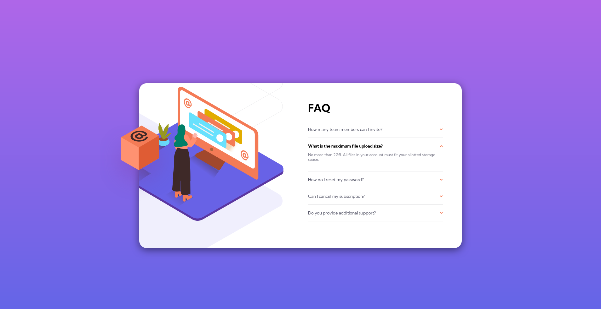

# Frontend Mentor - FAQ accordion card solution

This is a solution to the [FAQ accordion card challenge on Frontend Mentor](https://www.frontendmentor.io/challenges/faq-accordion-card-XlyjD0Oam).

## Table of contents

- [Overview](#overview)
  - [The challenge](#the-challenge)
  - [Screenshot](#screenshot)
  - [Links](#links)
- [My process](#my-process)
  - [Built with](#built-with)
  - [What I learned](#what-i-learned)
- [Author](#author)

## Overview

This was a challenge a little harder than it sounds. I had already seen the accordion list in the JS course I'm studying, but I decided to accept the proposed challenge of doing it only with HTML and CSS. Resolving this was fine, but I had some problems with the responsiveness of the layout, which took me a lot of time. There are still some details to be resolved, but I think the work done so far is quite satisfactory and it's good to see the power of HTML and CSS against challenges that previously involved JavaScript to be resolved.

### The challenge

Users should be able to:

- View the optimal layout for the component depending on their device's screen size
- See hover states for all interactive elements on the page
- Hide/Show the answer to a question when the question is clicked

### Screenshot

### Links

- Solution URL: [Frontend Mentor](https://www.frontendmentor.io/solutions/simple-html-and-css-solution-without-js-nuEfzVHZP)
- Live Site URL: [GitHub Pages](https://caioalvesp.github.io/faq-accordion-card/)

## My process

### Built with

- CSS custom properties
- Flexbox
- Mobile-first workflow

### What I learned

I got the details tag tip by doing the LinkedIn HTML test. From there, it was a matter of learning how to deal with the tag in CSS, which was very simple. However, as I said, I had some problems with responsiveness, among others, how to position the elements, especially the images. Although the layout is very simple, these questions gave me a job that I didn't have in the last few challenges, which served to make me think of solutions that subvert what I had already thought of before, which was very stressful but fun in the end.

## Author

- GitHub [Caio Alves](https://github.com/CaioVito)
- Frontend Mentor - [@CaioVito](https://www.frontendmentor.io/profile/CaioVito)
